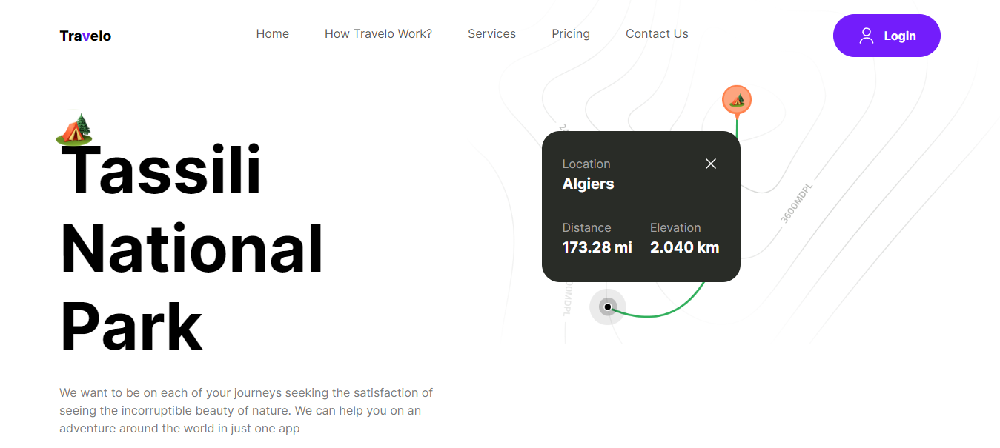
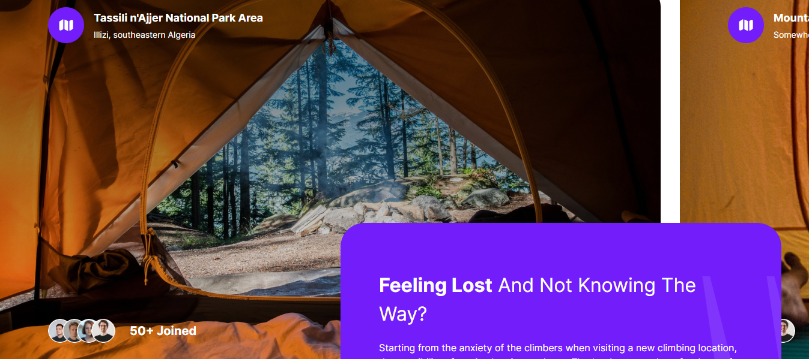
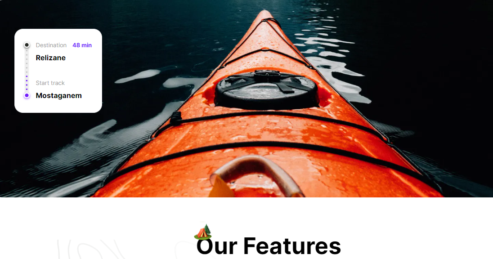

**Note: This repository contains the code for the landing page only and not the entire website.**

# Travelo: Your Adventure Companion 🌍

Explore the world with Travelo – the ultimate adventure companion. 🚀 Experience the freedom of offline maps, plan exciting adventures with friends, and navigate your hiking trails using cutting-edge augmented reality technology. 🗺️ Discover new locations every month, thanks to our global community of climbers sharing their best experiences. With Travelo, your next adventure is just a click away. 🌄

## Key Features:

- **Offline Maps:** Real maps can be accessed offline, ensuring you're never lost in the wild without a signal. 🗺️
  
- **Adventure Scheduling:** Set an adventure schedule with friends and explore interesting offers from Hilink on holidays. 🗓️

- **Augmented Reality Technology:** Navigate hiking trails using the latest augmented reality technology, even without an internet connection. 🌐

- **New Locations Every Month:** Join our worldwide community of climbers and discover numerous new locations shared every month. 🌍

## Screenshots:

### Hero section

### Camp Section

### Guide Section

## Get Started:

This is a [Next.js](https://nextjs.org/) project bootstrapped with [`create-next-app`](https://github.com/vercel/next.js/tree/canary/packages/create-next-app).

1. Clone the repository.
2. Install dependencies using `npm install`.
3. Start your adventure with `npm run dev`.

Happy Exploring! 🌲🏞️

